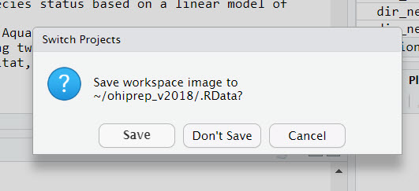

## BIG BIG Picture

* If you haven't already, consider adopting [Github](https://github.com/).  We create a repo for every project. Github makes sharing code and data much easier!
* Use Github issues to communicate about projects.
* Find a supportive group to keep learning about R.

## Other stuff

### File Organization

* Have a plan for organizing your files (data, scripts, outputs, functions, etc.).  Here is the [SOP](https://rawgit.com/OHI-Science/ohiprep_v2018/master/src/dataOrganization_SOP.html) (standard operating proceedure) we use to organize the files we use to calculate the Ocean Health Index.  Some people recommend following the organization used for R packages.
* Place a description of the file organization in a prominant place of your working folder.  We link to this document in our Rmarkdown files.  Most projects will not need something this complicated, in this case, the information can be directly included in a README.

### Coding practices
* Put code in Rmarkdowns to improve flow between documentation and scripting.  Break code chunks into manageable pieces.  Here is an [example](https://rawgit.com/OHI-Science/ohiprep_v2018/master/globalprep/ico/v2018/ico_data_prep.html) of one of the Rmarkdown files we use to wrangle Ocean Health Index code.
* Document Document Document!!!
* Check data as coding
     + Get in the habit of checking dimensions of data after joins
     + Pay special attention to what missing data is doing throughout an analysis
     + Document expectations (e.g., "# length of this vector should be 0")
* Save intermediate data files if they take a long time to create or have information that might be useful for other aspects of the analysis
* Avoid long dplyr chains
* Use the ```here``` [package](https://github.com/jennybc/here_here) to standardize file paths

### Final checks
* Close everything, restart, and rerun everything (except the really long processes).  Do not save the workspace image!!!
     + Does the code still run?
     + Do you get the same results (we love ```git2r``` to get previous versions of data)?
     + Be sure to check the NA's!
     + Review warnings

Always select "Don't Save" here: 



    
* External review: But focus on difficult sections of code!