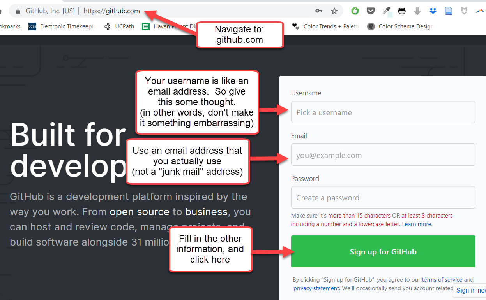
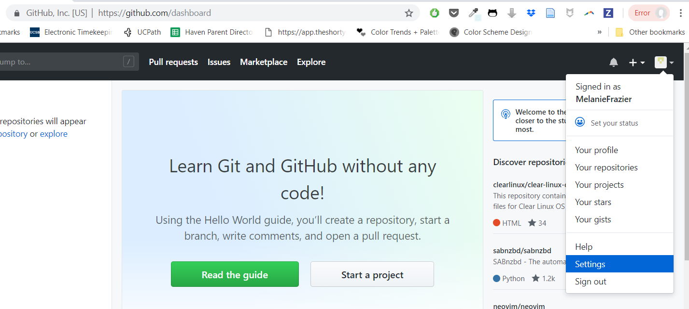
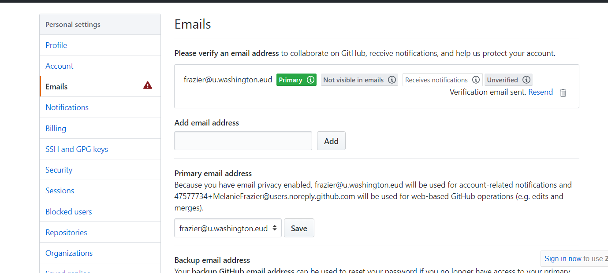

We will be using Github's "issues" feature to keep track of our blogpost ideas and coordinate together. 

## Signing up
The first step is to sign up for a GitHub account.  

Navigate to [Githubs website](https://github.com) and enter your information in the "Sign up for GitHub" area:

 

Choose the "Free" plan and do *NOT* select "Help me set up an organization next".  

Go through the remaining steps of the sign up process.

You should be signed into your GitHub account. Navigate to the "Settings" and explore the changes you can make to your account:

 

You should receive an email to verify your address.  If you don't receive the email, you can check the "Emails" tab in your Settings to make sure everything is correct:

