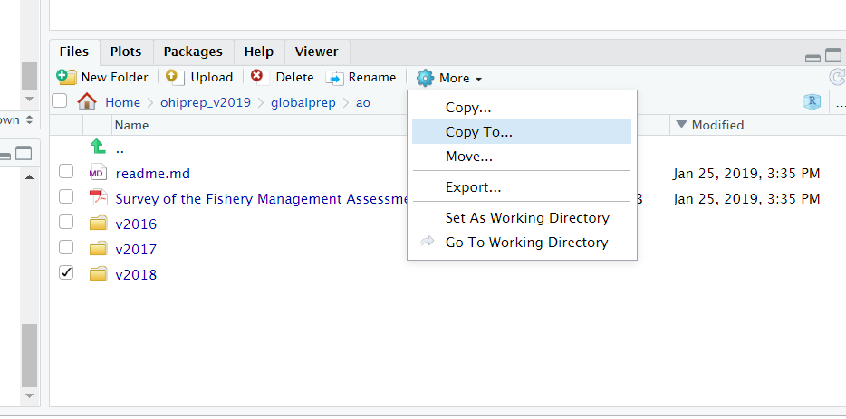
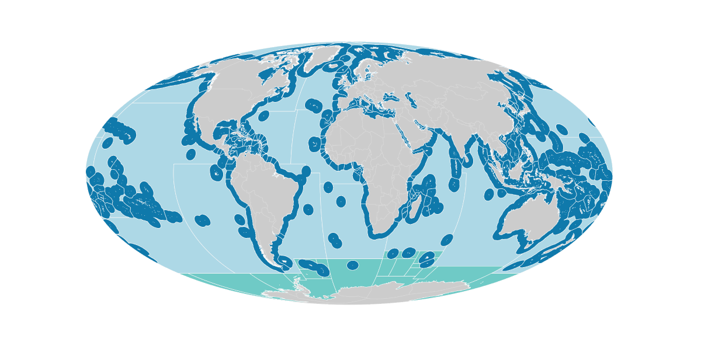

All data layers are prepared in the ohiprep_v20?? repository.  

Spend some time researching the data prior to launching into the coding in R.  I look over the files in the dataprep folder on Github, as well as the Mazu folder that contains the raw data. I research the specific data layers I will be working on and the goals/pressures/resilience dimensions they are used to calculate.  I typically start in the [methods](https://raw.githack.com/OHI-Science/ohi-global/published/global_supplement/Supplement.html) document.  I also research the source data, looking over websites, reports, and published papers.  

In regard to preparing the data, the best approach is to prepare the layer or layers within a single Rmd script and then update the OHI scores one layer at a time.  This approach makes it much easier to identify and track potential errors.

This section will discuss:
1. File organization
2. Starting a new data prep project
3. Anatomy of a typical data prep script
4. Notes on parallel processing

*** 
## File organization

### Saving external data
In almost all cases, OHI data comes from other institutions. We save these data to   
the NCEAS private server (Mazu) because we do not want to be responsible for serving other people's data.

These data are saved to Mazu: git-annex/globalprep/_raw_data in a folder that is labeled with an abbreviated version of the datasource (Figure 1). The data is saved to a folder describing the year the data was downloaded (e.g., d2015, d2016).  

Figure 1: Location of raw data saved to Mazu.


Every raw data folder should have a README.md (keep the caps so it is consistent and easy to see). *Note we are using .md rather than .txt even for READMEs on Mazu. 

Each README should include the following ([template](https://github.com/OHI-Science/ohiprep/blob/master/src/templates/generic_raw_data_README.md)):

* Detailed source information. For example:
    + full paper citation and link for publication
    + Link to online data source
    + Full email history with data provider 
* If it was downloaded online, provided written and visual instructions so that the reader can mimic your same steps to get the same data. Include screenshots if possible!
* Version information for data
* Years included in the datatset
* Year the data was published
* Type of data included in the dataset (e.g., catch per species (tons) per country)
* Any other information that could possibly be useful to anyone
  

***

### globalprep files 

All of the R scripts and metadata used to prepare the data, as well as the final data layers are saved in the Github ohiprep_v???? repository in the globalprep folder.  

The only data that will not be saved on Github are files that are too large or incompatible with Github (see below).

**Primary goal/component folder** The folder should be named according to the OHI target (the goal or dimension that the data is used to calculate). For example the folder for the tourism and recreation goal would be called: globalprep/tr (see table below). These recommendations are flexible and should be modified as needed, for example goals can be combined in a single folder (e.g., spp_ico) or, there may be several folders for different components of a single goal (e.g. tr_sustainability and tr_tourists).

target      |   suggested folder name
----------- | ------------------
Artisanal Fishing Opportunity | ao
Carbon Storage | cs
Clean Waters | cw
Coastal Protection | cp
Coastal Livelihoods | liv
Coastal Economies |eco
Fisheries   | fis
Habitats | hab
Iconic Species | ico
Lasting Special Places | lsp
Mariculture | mar
Natural Products | np
Species    | spp
Tourism and Recreation | tr
Pressure | prs_*additional_pressure_id*
Resilience | res_*additional_resilience_id*


This folder will contain:

* a *README.md* that will link to the appropriate information pages on ohi-science.org  The README.md should follow this  [template](https://github.com/OHI-Science/ohiprep/blob/master/src/templates/generic_readme.md).
    
* **Year-specific folders** within the goal/component folder organize output by assessment year (v2015, v2016).  Each of the assessment year folders should have:
      * a README.md (see [this template](https://github.com/OHI-Science/ohiprep/blob/master/src/templates/generic_readme_year.md)) 
      * a data_prep.R, or .Rmd that is well-documented. [Here is the dataprep template](https://github.com/OHI-Science/ohiprep/blob/master/src/templates/generic_data_prep.Rmd). 
      * a series of folders to organize data that include:
        + `raw` for 'raw-ish' type files that would not be on the server. This is typically for piecemeal raw data that we compile (e.g., U.S. State Department travel warnings), and not data we have downloaded from a single source (which would go on Mazu).  In most cases, this folder will not be used.
        + `int` for intermediate files (previously we’ve used tmp, working, or other naming conventions so this might not be entirely consistent).
        + `output` for the final data layer that is used in the OHI toolbox.

The final datasets (the ones stored in the `output` folder) will be preceeded by the target abbreviation followed by an underscore that provides a brief description of the data, e.g., tr_sustainability.csv).


***

### Intermediate files that are too large for Github

These files will be saved on Mazu, the internal server's, globalprep folder.

Our goal is to have everything (except for data obtained from other sources) stored on GitHub, but some files are too large or inappropriate for GitHub and must be stored on Mazu. Each of these files should be stored in a way that mirrors that on Github. If there is a need to make a duplicate folder on `git-annex`, it should have the same name as the folder used in GitHub.


Store any intermediate or final output files that are too large for github in these folders. Keep the same subfolder structure. If you are working in `spp_ico` and have temporary rasters to store on Mazu, save them in a folder named `int`. 

**Raw data should not be stored here. This should be stored in Mazu's `_raw_data` folder**

*** 

## Starting a new data prep project

### Prepare the dataprep folder

In ohiprep_v20??/globalprep navigate to the folder that contains the files you will need to prepare the data.  Select the most recent assessment year of data and copy/paste to create a new folder in the same location, changing the name to reflect the current assessment year.

For example, if we are preparing data layers for the 2019 assessment for the artisanal opportunities goal, ao, we would copy the v2018 folder and name it v2019.



Next, delete all unnecessary files, particularly the files in the raw, intermediate, and output folders!  New versions of these data will be created in the updated data_prep script, and you want to be sure that this is indeed what happens. If there are data already in the folder it can be easy to overlook a mistake, such as not using the correct file path to save the data, etc..

Typically, you not delete the dataprep script/s and README.  Youl will also want to preserve the folder structure.  If in doubt, I delete the files and then copy them over as needed.  For some goals, such as fisheries, there are lots and lots of files and it is very confusing. In these cases, I just copy the files as I need them. 

Once you have created and cleaned the new folder commit and push the updates!

### Start an issue
On Github create an issue for this dataprep project.  Here you will document progress, report problems or concerns, pose questions, describe changes to code, and report on final results.  

Once the relevant data layers are created and incorporated into the OHI scores this issue will be closed.

### Update the files

Carefully walk through the data prep script/s and update as necessary.

You will also need to update READMEs.

As you check and update the scripts, don't assume everything is correct.  There could be changes to the source data that introduce errors (this often happens).  We could have made a mistake somewhere.  And, even if there aren't any mistakes, there is usually room for improvement.

Checking the dataprep scripts involves:

* Going through each line of code to understand what is happening. Each step of dplyr chains should be evaluated, rather than running the entire chain and assuming it is correct.
* Using functions such as summary, dim, length functions and figures to explore the data at different stages of preparation. 
* Check the dimensions of the dataframe after each join or spread/collapse to ensure the length of the updated data makes sense.
* Check that the frequency of NA values seems reasonable, especially after joins and spread/collapse functions.  And, if you gapfill missing values, make sure that you end up estimating all NA values.

***

## A typical data prep script

All data prep is performed in R or, preferrably, Rmd documents. Rmd is an ideal format because it seemlessly integrates code and documentation, can display figures, and the output provides a clean methods document.

We have several shared practices for preparing data:

* Ideally Rmd/R files are used to download and save source datafiles, but this isn't possible in most cases due to the format of the data.
* We put a large premium on documenting the steps used to prepare data! 
* In many cases, the data preparation for a goal is performed in a single file.  But, for more complex goals it is better to break the data preparation into multiple Rmd documents.  If multiple Rmd documents are used, a README must describe what each Rmd document does, the input/outputs, and the order of processing.  
* If a process is run multiple times, the code should be converted to a function and placed in folder labeled R or src. 
* The `here` package, and `here()` function should be used control file paths.
* We use the tidyverse for tidying data

A typical data prep script (or series of scripts) will include the following sections, which are described in more detail below:

1. Summary: general description of the data prepared by the script
2. Updates: updates to source data and/or methods from previous year
3. Data sources: description of source data
4. Set up: code chunk that loads relevant R packages and functions
5. Data prep: code chunks for preparing the data, this is typically the bulk of the Rmd file
6. Gapfilling: code chunks for estimating and documenting missing data
7. Results check: code used to check results
8. Final run: a final run of all the code after restarting R


A generic data prep Rmd file is located on Github: github.com/OHI-Science/ohiprep_v2019/workflow/templates/generic_data_prep.Rmd


## prep Rmd: 1. Summary
This section describes the purpose of the script and the data layers that are generated.

## prep Rmd: 2. Updates
This sections describes all the updates to source data and/or methods since the previous year's assessment.

## prep Rmd: 3. Data sources
This sections describes all data sources and may include:

**Reference**: [citation for source data; website, literature, contact information. Version of data (if relevant).]

**Downloaded**: [date downloaded or received]

**Description**:  [e.g., surface aragonite state]

**Native data resolution**: [e.g., 1 degree, 30 m, country, etc.]   

**Time range**: [e.g., 1880-1899, monthly data provided for each year] 

**Format**:  [e.g., NetCDF, Excel file]

## prep Rmd: 4. Set up 
This code chunk is used to load packages, source functions, and set variables used throughout the analyses.  

### Packages
The packages we load depend on the analyses, but we always use:
* dplyr and tidyr: data wrangling tools (a cheatsheet: https://www.rstudio.com/wp-content/uploads/2015/02/data-wrangling-cheatsheet.pdf)
* here: controls file paths (https://github.com/jennybc/here_here)

We often use the following for spatial analyses:
* rgdal: tools for dealing with coordinate reference systems
* sp: classes and methods for spatial data
* sf: a new version of sp, providing a standardized way to encode spatial vector data
* raster: reading, writing, manipulating, analyzing and modeling of gridded spatial data
* fasterize: a better way to convert a shapefile to a raster file

We often use the zoo package for time-series data. 

And, for parallel processing, typically used to perform spatial analyses, we use:
* doParallel
* foreach

### common.R
Nearly all scripts will source a common.R file.  This file creates several objects that make it easier to conduct an OHI assessment.  This includes:

object   | description  
--------- | ---------------------------------
dir_M   |  file path to Mazu
mollCRS |  crs code for the mollweide coordinate refernce system we use in the global assessment 
regions_shape() | A function to load a simple feature object called "regions" with polygons for land/eez/highseas/antarctica regions. The "regions" object uses the Mollweide coordinate reference system.  
ohi_rasters() |  function to load two rasters: global eez regions and ocean region
rgn_data() | function to load 2 dataframes describing global regions
rgn_syns() | function to load dataframe of region synonyms (used to convert country names to OHI regions)
low_pop() | function to load dataframe of regions with low and no human population
UNgeorgn() | function to load dataframe of UN sociopolitical regions, typically used to gapfill missing data

To load the data in a data function: 

```{r}

source('http://ohi-science.org/ohiprep_v2019/workflow/R/common.R')

# call the function to load the data, the message describes the available data: 
region_data()

head(rgns_all)
head(rgns_eez)

```

#### metadata for common.R

*dir_M and mollCRS*

The following are the dir_M and mollCRS objects:

```{r}
## dir_M describes the path to our internal server based on your computer's operating system
## NOTE: The following may be different on your operating system
dir_M

## mollCRS is the code for the Mollweide coordinate reference system
mollCRS


```


*regions_shape*
The regions_shape function returns a simple feature object called "regions". Regions is the master global shapefile that includes polygons for land, eez, high seas, and antarctica regions in the Mollweide coordinate reference system.

Sometimes it is necessary to convert from a simple feature object to a shapefile object because some functions still do not work with simple feature objects, or, if the spatial file is modified, a saved shapefile may be desired.  This is accomplished like this:

`regions_shape <- as(regions, "Spatial")`

```{r, eval=FALSE, echo=FALSE}

library(sf)
library(here)

regions_shape()
head(regions)

table(regions$type_w_ant)

png(here("Reference/Quickguide_OHI_global/images/regions.png"), width=4, height=2, units="in", res=300)
 par(mar=c(1,1,1,1))
land <- dplyr::filter(regions, type_w_ant %in% c("land", "land-ccamlr", "land-disputed", "land-noeez"))
plot(st_geometry(land), col="gray80", border="gray85", main=NA, key.pos=NULL, lwd=.2)
ocean <- dplyr::filter(regions, type_w_ant == "fao")
plot(st_geometry(ocean), border="gray97", col="lightblue", main=NA, key.pos=NULL, add=TRUE, lwd=.2)
eez <- dplyr::filter(regions, type_w_ant %in% c("eez", "eez-disputed", "eez-inland"))
plot(st_geometry(eez), col="#0F79AB", border="gray97", main=NA, key.pos=NULL, add=TRUE, lwd=.2)
ant <- dplyr::filter(regions, type_w_ant %in% c("eez-ccamlr"))
plot(st_geometry(ant), col="#6FCAC6", border="gray97", main=NA, key.pos=NULL, add=TRUE, lwd=.2)

dev.off()

```


The regions file with land (gray), eez (dark blue), fao or high seas (light blue), and antarctica or CCAMLR (green) regions.



The regions object is a simple feature multipolygon spatial object in the Mollweide coordinate reference system. There are 7 fields described in the table

field    |  data type | description    | examples
--------- |---------------- | --------------- | ----------------------------
type_w_ant | factor | identifies all polygons as eez, fao (high seas), ccamlr (antarctica), or land               | eez (n=220), fao (15), eez-ccamlr (19), land (220), land-ccamlr (9), eez-disputed (1), land-disputed (1), eez-inland (3), land-noeez (38)
rgn_type   | factor | similar to type_w_ant, but does not specify eez/ccamlr and land/land-ccamlr regions                | eez (n=239), fao (15), land (229), eez-disputed (1), land-disputed (1), eez-inland (3), land-noeez (38)
rgn_ant_id | numeric  | region ids     | 1-250 country land and eez (these are the official global regions; some numbers are skipped); 255 disputed land and eez; 260-277 fao high seas; 301-337 (country land, no eez); 248100-288300 CCAMLR regions 
rgn_id     | numeric | region ids; similar to rgn_ant_id, but Antartica/CCAMLR regions lumped as region 213               | 1-250 country land and eez (these are the official global regions; some numbers are skipped); 255 disputed land and eez; 260-277 fao high seas; 301-337 (country land, no eez)
rgn_name   | character | country/territory name  | e.g., Afghanistan, Belize, Prince Edward Islands
rgn_key    | factor | 3 letter identification code  | e.g., AFG, BEL
area_km2   | numeric | area of region, km2  | range of 1-30604795

*ohi_rasters*
The ohi_rasters function returns two rasters, "zones" and "ocean", both with ~1 km resolution and the mollweide coordinate reference system.

The "zones" raster cell values are the OHI region ID.  The raster cell values can be linked to the region names using the region_data() function, and the rgn_ant_id variable from rgns_all.csv.  This raster is typically used to extract pressure data for the eez regions.

```{r, eval=FALSE, echo=FALSE}

library(sf)
library(here)
library(raster)
library(beyonce)

region_data()

pal <- sample(beyonce_palette(74, length(rgns_all$rgn_ant_id), type = "continuous"))

png(here("Reference/Quickguide_OHI_global/images/regions_raster.png"), width=4, height=2, units="in", res=300)
 par(mar=c(0,1,0,0))
plot(zones, breaks=sort(rgns_all$rgn_ant_id), col=pal, legend=FALSE, axes=FALSE, box=FALSE)
dev.off()

```


The "ocean" raster identifies ocean cells with a value of 1, and other cells are NA [NOTE: There is something weird about this raster in that it lists the values as 0, 255 (min, max), when in fact there are only 1 and NA values! If you need to convince yourself of this, you can use the `freq(ocean)` function to identify all cell values.].  This raster file is typically used to mask the ocean regions for pressure data.  

```{r, eval=FALSE, echo=FALSE}

library(here)
library(raster)


png(here("Reference/Quickguide_OHI_global/images/ocean_raster.png"), width=4, height=2, units="in", res=300)
 par(mar=c(0,1,0,0))
plot(ocean,  col="lightblue", legend=FALSE, axes=FALSE, box=FALSE)
dev.off()

freq(ocean)
#      value     count
# [1,]     1 416190801
# [2,]    NA 329175249
     
```


*region_data()*
The region_data function returns two dataframes, "rgns_all" and "rgns_eez".

The "rgns_all" dataframe includes data for the eez, fao, and ccamlr ocean regions.  The IDs in rgn_ant_id correspond to the IDs in the zones raster. Once raster data are extracted for each region, the output is often aligned with the data in this dataframe. 

*Metadata for rgns_all dataframe*
field    |  data type | description    | examples
--------- | ---------------- | --------------- | ----------------------------
rgn_type   | factor | similar to type_w_ant, but does not specify eez/ccamlr and types  | eez (n=239), fao (15)
type_w_ant | factor | identifies all ocean polygons as eez, fao (high seas), ccamlr (antarctica)  | eez (n=220), fao (15), eez-ccamlr (19)
rgn_id     | numeric | region ids; similar to rgn_ant_id, but Antartica/CCAMLR regions lumped as region 213               | 1-250 country eez (these are the official global regions; some numbers are skipped); 255 disputed eez; 260-277 fao high seas
rgn_ant_id | numeric | region ids     | 1-250 country eez (these are the official global regions; some numbers are skipped); 255 disputed eez; 260-277 fao high seas; 248100-288300 CCAMLR regions 
rgn_name   |  character | country/territory name  | e.g., Afghanistan, Belize, Prince Edward Islands

The "rgns_eez" dataframe includes data for the 220 OHI regions plus Antarctica (rgn_id 213).  This file is used to make sure that all regions are included in dataprep files.  It also includes data to indicate whether regions are territories.  This can also be used for gapfilling (in some cases, it makes sense to assign territories the same value as their administrative country).  

*Metadata for rgns_eez dataframe*
field    |  data type | description    | examples
--------- | --------------- | --------------- | ----------------------------
rgn_id   | numeric | official global regions (except Antarctica, 213) | 1-250
rgn_name   |  character | country/territory name  | e.g., Afghanistan, Belize, Prince Edward Islands
eez_iso3    | factor | 3 letter identification code  | e.g., AFG, BEL
territory   | boolean | identifies whether the region is a territory | yes/no
admin_rgn_id | numeric | administrative country rgn_id if a territory, otherwise the rgn_id | 1-250
admin_country_name | character | administrative country name if a territory, otherwise the country name | e.g., Afghanistan, Belize, Canada

*region_syns()*
Observed synonyms for each region, such that each region may have multiple synonyms.  These data are used to convert outside data to the OHI region name and ID.  This list is updated nearly everytime we run an assessment!


*Metadata for region_syns dataframe*
field    |  data type | description    | examples
--------- | ---------------- | --------------- | ----------------------------
rgn_id     | numeric | region ids               | 1-250 
rgn_name   |  character | country/territory name  | e.g., Federated State of Micronesia; Micronesia, FS; Micronesia (Federated States of)
rgn_key    | factor | 2-letter code for countries | e.g., FM
eez_iso3   | factor | 3-letter code for countries | e.g., FSM
rgn_typ    | factor | status of region            | disputed, landlocked, largescale (global, world); ohi_region

*low_pop()*
Includes data for 21 regions with 0 and low populations.  These data are used to identify regions that should have NA values because the goal does not apply to regions with no/low populations (e.g., livelihoods and economies).

*Metadata for low_pop dataframe*
field    |  data type | description    | examples
--------- | --------------- | --------------- | ----------------------------
rgn_id     | numeric | region ids               | 1-250 
rgn_nam   |  character| country/territory name  | e.g., Macquarie Island, Wake Island
Southern_Island    | boolean | indicates if region is a southern island | 1/0
Inhabited   | boolean | indicates if region is uninhabited | boolean, 1/0
est_population    | numeric | number of established people in region  | 0-3000

*UNgeorgn()*
Each global regions UN georegion based on social and geopolitical considerations. 

*Metadata for UNgeorgn dataframe*
field    |  data type | description    | examples
--------- | --------------- | --------------- | ----------------------------
rgn_id     | numeric | region ids               | 1-250 
r0_label   |  factor | most inclusive category | World
r1_label    | factor | 7 classes | Africa (N=46), Americas (3), Asia (39), Europe (43), Latin America and the Caribbean (48), Oceana (34) Southern Islands (7)
r2_label  | factor | 22 classes | e.g., New Zealand, Melanesia
rgn_label | character | global region name | e.g., Cocos Islands, Christmas Island
Inhabited   | boolean | indicates if region is uninhabited | boolean, 1/0
est_population    | numeric | number of established people in region  | 0-3000

## prep Rmd: 5. Data prep

We follow several coding practices when preparing our data:   

* Code chunks are broken into manageable pieces and are proceeded by a description of what is being accomplished 

* The code within a chunk is documented to make it easier to follow and to help prevent errors.  For example, expected values and results are described to help prevent potential errors (e.g., check to see all values between 0-1, length should be 0, etc.). 

* Run-on dplyr chains are avoided because they are impossible to follow and prone to error!

* Data is checked throughout the dataprep process (checking dimensions of data after joins, special attention to missing data, etc.)

* Intermediate data files are saved if they computationally take a long time to create or have information that could be useful in other aspects of the analysis. 

* The here package is used to standardize file paths.


The final output should be a dataframe that includes:

* *rgn_id* All 220 regions should be included in the final file!
* *year* This should include all years of data necessary to calculate scores for all scenario years, including trend. For some data layers the data has never been updated, in these cases, there is still a year column but it may only contain a single year.
* *value* This column will contain the calculated value for the data, and the column name will vary across datasets. In general, naming conventions should be consistently used every year, but feel free to modify the column name if you feel it could be improved.  Just be sure to make the corresponding change to the "name_data_fld" in this file: https://github.com/OHI-Science/ohi-global/blob/draft/eez_layers_meta_data/layers_eez_base.csv.

This file should be saved as a .csv file in an "output" folder. In general, the name of the file should be the same as the previous year.  However, if you feel the file name can be improved, you will need to update the fn variable in this data file:

https://github.com/OHI-Science/ohi-global/blob/draft/eez_layers_meta_data/layers_eez_base.csv

 
## prep Rmd: 6.  Gapfilling

We make every effort to gapfill missing data.  The only legitimate reason for a region to have an NA value is if the goal is not relevant to the region.  For example, the livelihoods and economies goal is not relevant for an uninhabited island.

We have a paper describing why and how we estimate missing data: https://journals.plos.org/plosone/article?id=10.1371/journal.pone.0160377. But the following is the short version.

The first step to gapfilling missing data is to identify datasets that are predictive of the variable you are attempting to estimate and is also more complete.  Here are some of the general approaches we use to estimate missing global data:

* Some mising data can be estimated from the original source.  For example, if there are some missing years within a dataset, we can often estimate these values using a linear model of available data.  For spatial raster data, we often estimate missing values using nearby raster cells.  
* Secondary datasets can also be used to estimate mising values. For example, we gapfill some missing Social Progress Index values using World Governance Index data as a predictor.  And, in many cases we use [UN geopolitical data](https://github.com/OHI-Science/ohiprep_v2019/blob/gh-pages/globalprep/spatial/v2017/output/georegion_labels.csv) that classifies countries based on geopolitical and social variables to predict missing data.
* And, we often use multiple approaches to estimate missing values within a dataset.

Our goal is to estimate missing data using the simplest model that best predicts the data. Given this, it is necessary to determine whether datasets and model terms actually predict missing data and to compare the performance of multiple models. Ideally cross-validation methods are used to evaluate how well the models predict missing data, otherwise models will appear to perform much better than they actually do.   

*There is no point in having a model with many predictive variables and complex non-linear fits if it performs no better than using a simple mean of the existing data!*

Gapfilling steps are often mixed with the dataprep code.  Once the gapfilling is done, we will save a dataset describing which data were gapfilled and the method.  Every dataset should have a corresponding gapfilling dataset...*even if there was no gapfilling*.  

The gapfilling record is saved with the same name as the corresponding output data, but with a "_gf" extension.


The gapfilling dataset should mirror the corresponding dataset in regard to the number of rows and identifying columns (e.g., rgn_id, commodity, year, etc.). The gapfilling datset should include three additional columns that indicate the following:

* gapfilled: a zero or one value (or, NA if the value in the original data is NA) indicating whether the data was gapfilled or not.
* method: a short descriptor of the method that was used (this should be described more fully somewhere in the documentation).
* error: a numeric value describing the error around the estimate.  This should be left blank if this was not determined (most of the time this will not be estimated).


## prep Rmd: 7. Results check

It is critical to check the final output data!

Here are some of the ways we check data:

* Is each region included in the final data?
* Does the number of values for each region/year make sense (in most cases there should only be one value for each region/year)
* Does the ranking of the values make sense? Do the high and low performing regions seem reasonable?
* Do the number of NA values seem reasonable (ideally there will be none, unless the goal does not apply to that region)
* Does the range/distribution of values seem reasonable, for example, some outputs should range from 0-1.

The functions I use most commonly to check data are:
`hist()`, `summary()`, `dim()`, `table()`

Because we calculate the global index every year, the most powerful way of checking our data is to compare the current data with last year's data.  In most cases, source data will remain the same from year to year (although some agencies will update previous data). Consequently, any changes will often reflect changes to the model and/or mistakes.  

For this comparison we typically compare the most recent shared year of data between the two assessments.  The following code walks through this process using data calculated for the lasting special places goal.  In this case, we will pretend we have just completed preparing the data for the 2018 assessment and we want to compare the results to the 2017 assessment. Here we focus on the data for the 3nm offshore region.  

```{r}

library(dplyr)
library(here)
library(ggplot2)
library(plotly)

# want the region data from here:
source('http://ohi-science.org/ohiprep_v2019/workflow/R/common.R')

new <- read.csv(here("globalprep/lsp/v2018/output/lsp_prot_area_offshore3nm.csv"))
summary(new)

old <- read.csv(here("globalprep/lsp/v2017/output/lsp_prot_area_offshore3nm.csv"))
summary(old)

```

The most recent shared year between the two datasets is 2017, so this is the year that will be compared.  The old and new values are plotted as a scatterplot, with a point for each region.  We create an interactive plot and add a one-to-one line to make it easier to determine which regions have changed.  Any changes in values will reflect either changes to the source data or changes to the data prep script.

*It is important to explore the reasons for these changes because it could reflect errors!*

```{r}

# get region names
region_data()
head(rgns_eez)

compare <- new %>%
  rename(a_prot_3nm_new = a_prot_3nm) %>%
  left_join(old, by=c("rgn_id", "year")) %>%
  filter(year == 2017) %>%
  left_join(rgns_eez, by="rgn_id") %>%
  select(rgn_id, rgn_name, year, a_prot_3nm, a_prot_3nm_new) %>%
  mutate(region=paste(rgn_id, rgn_name, sep = "-"))

summary(compare)

compare_plot <- ggplot(compare, aes(x=a_prot_3nm, y=a_prot_3nm_new, label=region)) +
  geom_point() +
  geom_abline(slope=1, intercept=0, color="red")
  
ggplotly(compare_plot)

```

In this case, the values for most regions remain the same from the 2017 to 2018 assessment, however, there are some changes.  The biggest change was for Antarctica, which we can ignore because we do not calculate scores for Antarctica for the global assessment.  However, there is also a fairly large change in the Greece data, and some smaller changes for some other regions.

By carefully exploring the source data we found that these differences reflect updates to the source data.  For example, a marine reserve may have been established in 2017, but weren't yet incorporated into the World Database on Protected Areas. 


## prep Rmd: 8. Final run
The final step is to commit and push all files.  Then, close R and do NOT save the workspace image. The purpose of closing everything is to clear the memory of all data objects to make sure that the code still runs.  This may be a problem if we change object names but fail to make necessary corresponding throughout the code. 


I typically close everything by opening another repository.  

Restart R and return to the ohiprep repo and rerun everything (except any really long processes). 

Check the following:

* Does all the code still run?
* Do you get the same results (check to see if output csv files are loaded to the Git window, this indicates that the data probably changed)?
* Review warnings
* Identify parts of the code you are unsure of, and have someone review

***

## Notes on parallel processing

Coming soon!
