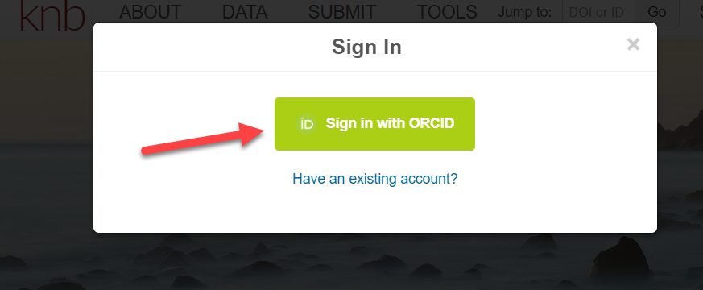
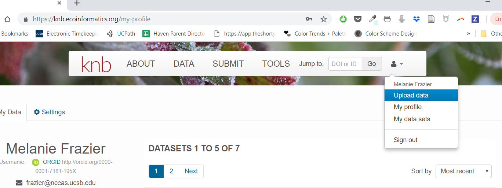
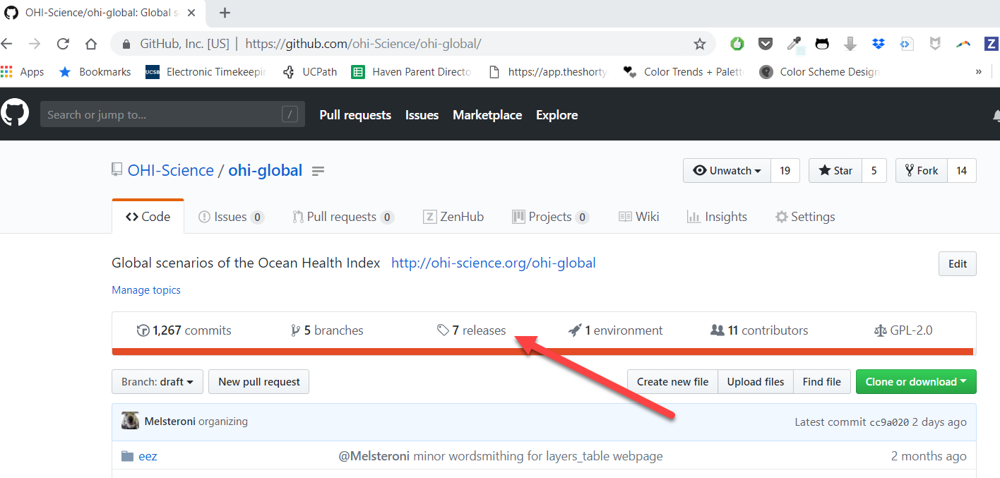
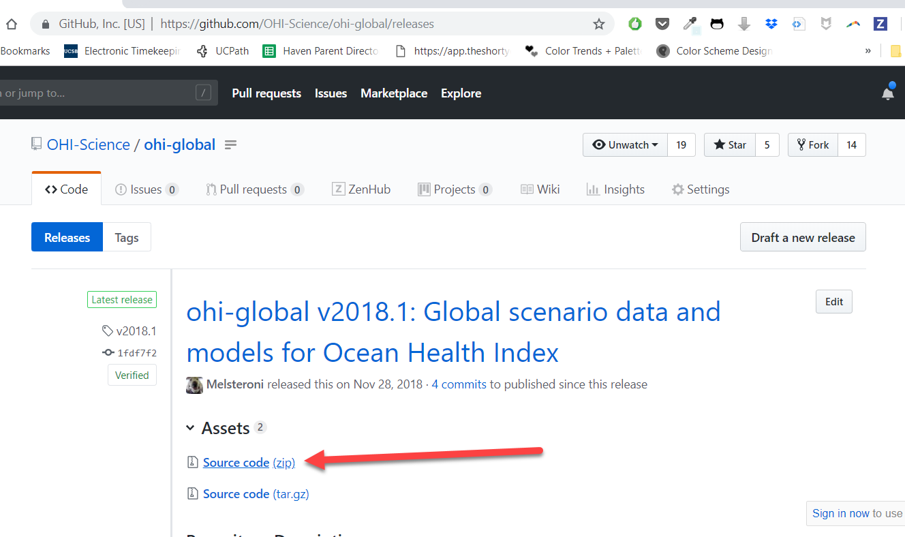
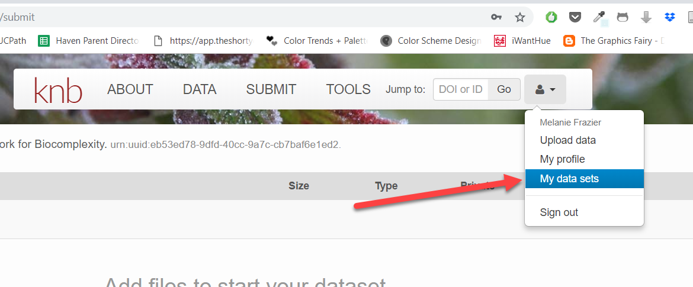
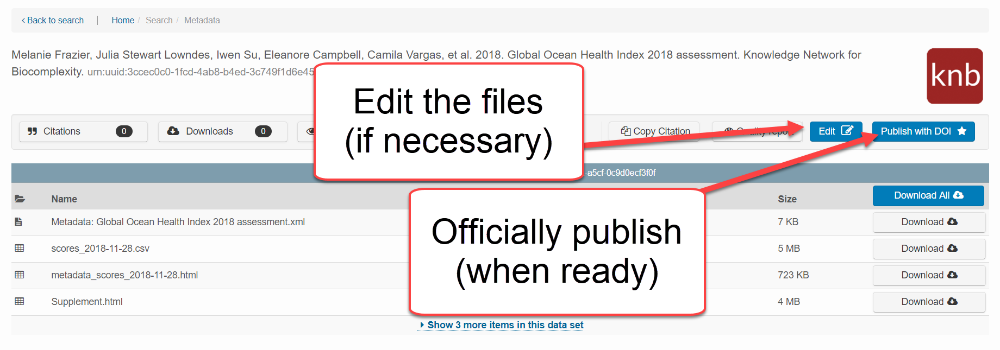

There are several steps after getting the scores to finalizing an assessment.  This guide walks your through these steps.  Each of the following steps is described in detail below:

1. Create results folder
2. Final score review
3. Methods document
4. Results document
5. Updates document
6. Update the website
7. Finalize and create a "release" for repositories
8. Upload to repository

## Create results folder
We summarize the results from each year's assessment in the yearly_results/global20?? folder.  

After the OHI scores have been updated with the new data layers a  global20?? folder should be created in the ohi-global/yearly_results folder, and populated with:

1. an empty "data_check" and "Results" folder
2. a copy of the README", "Results_first_look.Rmd", "Results/Supplement_Results.Rmd", and "Results/functions" from the previous year
3. you may find other files from previous years to be useful as well, but only copy them as needed (many of the files were created to meet needs specific to a particular assessment year)

The Results_first_look.Rmd creates an internal html document that provides our first look at the scores. This is mostly used internally to explore and check results.  This script also does the following: 

* copies the scores.csv from the eez folder to this (yearly_results/global20??) folder and appends the current date to the filename.  This allows us to version control our data so we can keep better track of it.  This is especially handy during the final stages of an assessment when there are lots of versions of the data flying around email and such!  
* creates a user friendly version of the data called OHI_final_formattted_scores_date.csv.  This is typically the version of data we provide to people.
* creates most of the data in the Results/data folder and figures in the Results/figures folder

It will be necessary to carefully walk through the previous year's version of the Results_first_look.Rmd file and make relevant updates as needed, such as:

   - on ~ line 88 change: `update_data = TRUE`
   - on ~ line 84 change the dateFile to the current date, e.g., `dateFile = '2018-10-03'`
   - correct links: [Data](https://raw.githubusercontent.com/OHI-Science/ohi-global/draft/global2018/OHI_final_formatted_scores_2018-10-03.csv)
   - read through to correct references to scores/regions

If there are any changes to the scores the Results_first_look.Rmd must be updated and rerun. 

## Final score review

Once all the data layers have been updated we conduct a final review of the scores, which involves these steps:

1. Update and disperse the [Results_first_look.html](https://rawgit.com/OHI-Science/ohi-global/draft/yearly_results/global2018/Results/Results_first_look.html) to team members to review.  
2. Meeting with team members to discuss scores, document questions/concerns in a new Github issue.
3. To address these concerns, review the data/code and, if necessary, update the scores with corrections to the data or code.  These checks are performed via R/Rmd scripts in the yearly_results/global20??/data_check folder.  The results from each check is also documented in the Github issue.
4. Update and rerun the Results_first_look.Rmd as needed
5. If necessary, we have a second meeting to discuss the updated scores (usually this isn't necessary).

## Methods document
Every year we update a document describing the methods used to calculate the assessment (example methods document: https://raw.githack.com/OHI-Science/ohi-global/published/global_supplement/Supplement.htmlhttps://raw.githack.com/OHI-Science/ohi-global/published/global_supplement/Supplement.html). 

This file can be accessed from our OHI-science global webpage.

The files used to create this document are located here: https://github.com/OHI-Science/ohi-global/tree/draft/global_supplement

To maximize flexibility, we have broken our methods into component parts that can be used in multiple contexts.  For example, the Rmd files that describe each data layer are incorporated into the official methods document and are also used to create a webpage describing the data layers. Previously, if we updated our methods we had to update both the methods document and the website, but with this approach we only have to make the change in one location.  This helps keep our messaging more consistent.  

*Table: A description of the files in the ohi-global/global_supplement repository*

folder/file name   | description   | updates
------------------- | -------------- | --------------------
Supplement.Rmd      | combines all components to create the final methods document | No changes to this script are likely necessary, but this Rmd must be knitted when any components change (see description below)
CombineLayers.R  | Combines all the layer Rmds located in the layers_info folder into a single Rmd file called layers_all.Rmd | No changes to this script are likely necessary, but this R file must be run whenever there are changes to any of the data layer Rmds
layers_all.Rmd | Created by CombineLayers.R, includes a description of all data layers | Created automatically when CombineLayers.R is run
OHI.bib  | A .bib file of the OHI references (more on that below) | Updated yearly
BIBcorrect.R | Corrects weirdness in the .bib file | This probably will need to be updated yearly; this will be determined after reviewing the formatted citation list
tables | folder with datatables of 10 goal and 8 subgoals | No changes likely necessary
index_scores.Rmd | description of OHI model for calculating index scores | No changes likely necessary
goal_model.Rmd | description of OHI model for calculating goal scores | No changes likely necessary
trend.Rmd | description of OHI model for calculating trend scores | No changes likely necessary 
pressure.Rmd | description of OHI model for calculating pressure scores | No changes likely necessary
resilience. Rmd | description of OHI model for calculating resilience scores | No changes likely necessary
goal_descriptions folder | individual Rmd files describing each goal/subgoal | Minimal changes to some files may be necessary if the model or data used in a goal changes
goal_descriptions_short folder | individual Rmd files with a *short* description of each goal/subgoal | Minimal changes to some files may be necessary if the model or data used in a goal changes
layers_info folder | individual Rmd files with descriptions of each data layer, filenames must match layer names in eez_layers_meta_data datatables | Changes to some layers will probably be necessary, but most layers will require no changes
figures folder | figures displayed in the Supplement.html | No changes likely necessary
methods-in-ecology-and-evolution.csl | instructions for displaying references | no need to change unless a different way of displaying references is desired

### Steps to updating methods document
The methods document is created by knitting ohi-global/global_supplement/Supplement.Rmd.  However, many preparations need to be made prior to knitting.

#### Step 1: Update eez_layers_meta_data
The data tables in ohi-global/eez_layers_meta_data are used to create the methods document, and consequently must be fully up-to-date and accurate!  This includes: layers_eez_base.csv, layers_eez_data_sources.csv, layers_eez_methods.csv, and layers_eez_targets.csv.  

Currently, the layers_eez_gapfill.csv is not used to create the methods document, but it is still a good idea to update this as well.

For information about updating these datatables, see: Coming Soon!

#### Step 2: Update OHI.bib
Make sure all references are included in the OHI Zotero library (see for more information: Coming Soon!).   Then export the OHI library as a BibLaTeX file and replace the OHI.bib file in ohi-global/global_supplement with the updated file.

We have noticed that some of the OHI.bib entries need to be modified to report correctly. For example, when the author of a report is an agency, such as the US State Depart, it will be reported as "Depart, US".  For this reason, we use the BIBcorrect.R file to correct and then overwrite the OHI.bib file.  

#### Step 3: Update layers_info
The layers_info folder includes an Rmd file for every data layer used to calculate the global OHI assessment.  The files describe the general methods and data used to generate the layer. Ideally, these Rmd files do not include information that changes each year (e.g., final year of data used in analysis, links to data preparation files on Github, etc), so they can be used each year with minimal changes.   Components that change every year should be included in tables, such as those in _ohi-global/eez_layers_meta_data. 

However, if there have been changes to the model or data used to generate a layer it will be necessary to update the corresponding Rmd file.

After the Rmds have been updated it is necesary to run the CombineLayers.R file, which merges all the layer information into a single document, layers_all.Rmd. 

#### Step 4: Review other files

Review whether any of the other files require editing.  There may be changes to the text to make it clearer, but otherwise, the following files are unlikely to change:  

There will be no changes to the following files: goal_model.Rmd, insex_scores.Rmd, pressure.Rmd, resilience.Rmd, or trend.Rmd, unless changes are made to the OHI models (which is unlikely).

The Rmds describing the goal models in the goal_descriptions and goal_descriptions_short folders will only change if there have been changes to the goal model or data.

Changes to the goal/subgoal descriptions in the "tables" folder are unlikely.

#### Step 5: Knit Supplement.Rmd
Review the Supplement.Rmd document to update the assessment year (i.e., title at top, assessmentYear variable in this code chunk, update figure 3.1).  Knit the file and review the html output.  Make any necessary changes and repeat...seemingly endlessly until everything is correct.

***
## Results document
After producing the final scores, we create a document that describes the results of the assessment: https://raw.githack.com/OHI-Science/ohi-global/published/global2018/Results/Supplement_Results.html. This file can be accessed from our OHI-science global webpage.

The file is created using this Rmd: ohi-global/yearly_results/global20??/Results/Supplment_Results.Rmd.  

It is critical to carefully step through this script and modify as needed; for example, the date of the radicalFile object must match the date appended to the csv file of scores created by Results_first_look.rmd (e.g.,  radicalFile = '2018-10-10', ~line 92).  

And, of course, freely modify this script to reflect the data/figures you believe will be most useful to people.  This could involve editing text, removing particular figures, adding figures, etc.

NOTE: If there are any changes to the scores, it is important to run the Results_first_look.Rmd file prior to running this script.  Many of the figures in the Supplement_Results document are actually generated by the Results_first_look.Rmd script.

***

## Updates document

***
## Upload to a repository

One of the final steps of an assessment is submitting the final data (and related files) to a data repository.  This makes the files publicly available and provides a DOI (digital object identifier, https://www.doi.org/) used to officially cite the data. We have been using the Knowledge Network for Biocomplexity, or KNB (https://knb.ecoinformatics.org/) as our data repository.  An example of our data on KNB is here: https://knb.ecoinformatics.org/view/doi:10.5063/F12Z13R6   

Signing into KNB requires an ORCID account. An ORCID account is obtained here: https://orcid.org/register.  You will then make your way to https://knb.ecoinformatics.org/. Select the SIGN IN tab, and then "Sign in with ORCID":

 

 
 

Select the "Upload data", and start adding files and information:
 

The following is the information we used for the 2018 assessment, but please modify and improve as desired!

#### Overview

Title: Global Ocean Health Index 2018 assessment

Abstract: Scores from the 2018 global Ocean Health Index (OHI) assessment and accompanying data and models. The global Ocean Health Index assesses ocean health for 220 coastal countries and territories and has been conducted yearly since 2012.  The Index describes how well we are sustainably managing 10 goals which represent the full suite of benefits that people want and need from the ocean.  These goals include: artisanal fishing opportunity, biodiversity, carbon storage, clean waters, coastal livelihoods and economies, coastal protection, food provision, natural products, sense of place, and tourism and recreation.  Each goal is given a score ranging from 0 to 100, and the full suite of goal scores are then averaged to obtain an overall index score for each region.  Please see http://ohi-science.org/ for additional resources and information.

Keywords: OHI, index, ocean 

#### People
OHI team (including the OHI Fellows)
Contacts: If in doubt, put Benjamin Halpern

#### Dates 
First data is 2012.  The later date is the year of the assessment.

#### Locations
Short geographic description: Global country and territorial EEZ regions (N=220)

Northwest coordinates: 90 -180
Southeast coordinates: -90 180 

#### Taxa
NA

#### Methods
Step 1: See Methods.html file

#### Add Files
Please use your judgment, but we included the following files in the global 2018 assessment:

* scores.csv: scores file that is created secondarily to include region names and expanded goal names. 
* Methods.html: methods used to calculate the global OHI scores (this is created in the global_supplement folder in the ohi-global repository).
* Global_OHI_Results: Figures and tables of global results.  This is currently an informal document, but I would like to improve this in future years.  
* Zip files of the 3 repositories used to calculate the global OHI assessment: ohiprep, ohi-global, and ohicore.  These files are downloaded from the "release" version of repository (this assumes you have already created the release).  You navigate to the release by first going to the repository of interest and selecting "releases": 

 

 
 
Then download the .zip option: 
 

 
 

Once all the information has been entered and the files uploaded to the KNB site you can obtain a link for your data.  Navigate to "My data sets" and select the one you are working on from the list and copy the web address.  Create an issue and provide the link so anyone who wants to review the information can do so.  You can easily edit everything at this point! NOTE: At this point the data does not have an official DOI.  

Once everyone is satisfied with the content, you can officially "Publish with DOI":

 
The data now officially has a DOI, and you can mark this off your list of things to do!

