There are several steps to beginning a year's assessment.  This guide walks through the steps you will want to take.  Each of the following steps is described in detail:

1. Review and organize relevant github issues
2. Prepare the repositories
    - ohiprep
    - ohi-global
3. Keeping track of layer progress


## Review and organize relevant issues
Review the github::issues and create a list linking to the particular issues that might be useful in the year to come.  This can include: 

* references/discussion that may lead to improvements to goal models, pressures or resilience
* new datasets that are worth exploring
* potential newimprovements to ohicore
* ideas for reorganizing/cleaning repos
* etc.  

Create a new issue that organizes and links to these issues.  This officially marks the start of the OHI assessment!

(This is also a good time to close issues that are completed or no longer relevant)

<br>
<br>


## Prepare the repositories!
In preparation for the new assessment, you will need to prepare the repositories we use for the global assessment.  

For the ohiprep repository, you will actually copy the previous year's assessment into a new repository with an updated name and delete the history.  This helps to keep the size of the repository under control.  For the ohi-global repository, you will update a couple files and perform a couple checks to make sure the scores do not change.

ohicore will probably not need any changes.  However, now is a good time to improve warning messages or add functions to improve analysis and visualization.

This is also a good time to think about making organizational changes to the repositories.  Sometimes an organizational scheme that worked well in the past doesn't work as well over time.

### ohiprep repository
Create a copy of the most recent ohiprep repository and rename with the new assessment year.  I use the following steps to do this:


1. If you don't have the most recent year's repository, clone it to your local machine.  For example, if the last completed assessment was in 2018, you would clone the https://github.com/OHI-Science/ohiprep_v2018.  Here is one approach using RStudio:
<br>
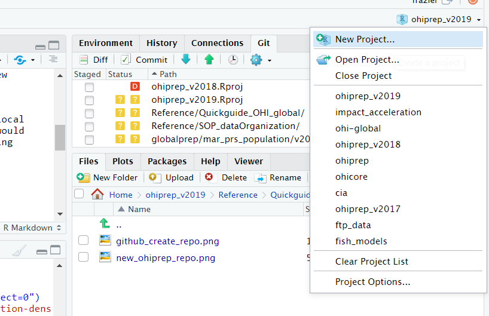
<br>
<br>
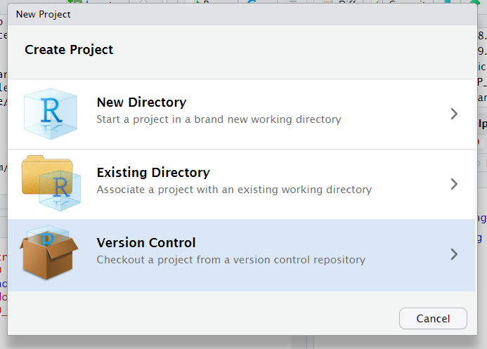
<br>
<br>
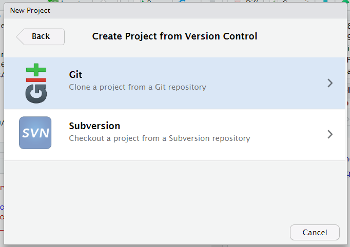
<br>
<br>
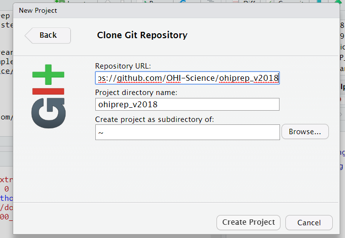

<br>
<br>
2. Navigate to https://github.com/OHI-Science and create a new repository: 

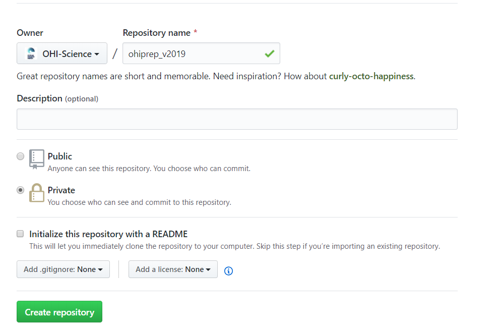

<br>
<br>
Use the following parameters (but change the year in the repository name to match the current assessment year):
<br>
<br>

<br>
<br>
3. Copy the contents of the old ohiprep repository into the newly created repository.  Open the ohiprep_v20?? project in RStudio, and navigate to the Shell:
<br>
<br>
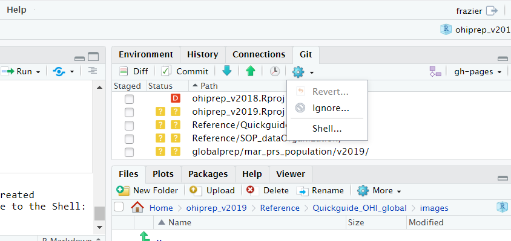
<br>
<br>
Make sure that you are in the old ohiprep working directory. This is indicated by the:
`C:\Users\Melanie\github\ohiprep_v2018` 

If you are not in the correct working directory use the `cd` command to navigate there.  Type in the mirror command:


<br>
<br>
4. Navigate to the new repository on Github.com, https://github.com/OHI-Science/ohiprep_v20??.git and make sure the folders/files are there.  Check that the default branch is "gh-pages" (and not the "master" branch).

<br>

5. Clone the new repo to your local system (instructions in step 1)


<br>
6. Delete the commit history of the new repository.  This gives us a clean slate to work from and keeps the repository from getting quite as big. I follow the general instructions from [here](https://gist.github.com/heiswayi/350e2afda8cece810c0f6116dadbe651).  Make sure you are in the working directory of the new repository, and in the shell type the following:


```

# Check out to a temporary branch:
git checkout --orphan TEMP_BRANCH

# Add all the files:
git add -A

# Commit the changes:
git commit -am "Initial commit"

# Delete the old branch:
git branch -D gh-pages

# Rename the temporary branch to master:
git branch -m gh-pages

# Finally, force update to our repository:
git push -f origin gh-pages

```
<br>

7. Navigate to the new repository on Github.com, https://github.com/OHI-Science/ohiprep_v20??.git and check whether there is only one commit. 
<br>

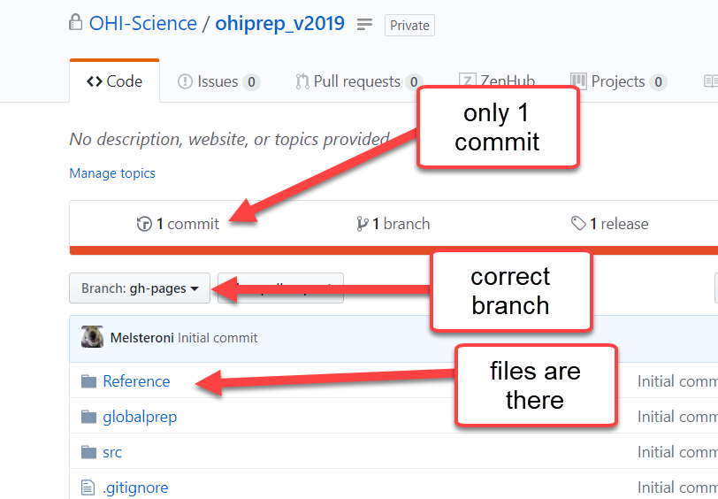

<br>
<br>
8. Update README.md and delete unnecessary .Rproj files with the wrong year, commit, push.

<br>

9. You are done....go have a cup of tea!


### ohi-global
The main files that get updated are:
 
* eez/conf/scenario_data_years.csv
* eez/calculate_scores.R

#### scenario_data_years.csv
For each data layer, the scenario_data_years.csv associates the year the source data was collected or reported  with the OHI assessment year.  The data looks like this:

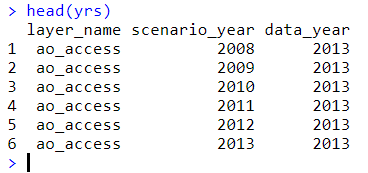

In this case, the data layer for ao_access (access to artisanal fishing opportunities data used to calculate the score for the artisanal opportunities goal) goes from 2008 to the most current assessment year (not shown).  The first OHI global assessment was in 2012 but the data goes to 2008 because five years of data are typically required to calculate trend.  In this case, the 2012 trend was calculated using data from 2008 to 2012.  The data year is 2013 for all assessment years because these particular data have never been updated.  

There is a helper script (eez_layers_meta_data/new_year_prep.R) that updates this file when embarking on a new assessment year.  This script adds an additional assessment year to the eez/conf/scenario_data_years.csv.  The data year is the same as the previous assessment year.  As each data layer is added to update scores, the data year must be manually updated directly within the eez/conf/scenario_data_years.csv.

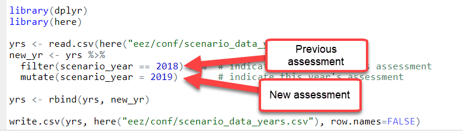


#### calculate_all.R
The calculate_all.R script, located in the eez folder, is the main script used to calculate scores.  This script creates objects used by ohicore functions, calls ohicore functions that calculate scores, and includes code to check results.  

This script needs to be updated for a new assessment year.  Specfically, links to the ohiprep repository (step 2) and the most recent assessment year (step 3) must be updated.

Once this script is updated, it is critical to walk through the entire script to make sure all the steps are working and there are no changes to the previous year's scores.  The ```ohicore::CheckLayers``` function will likely generate some warnings.  The following warnings are expected and do not indicate a problem:

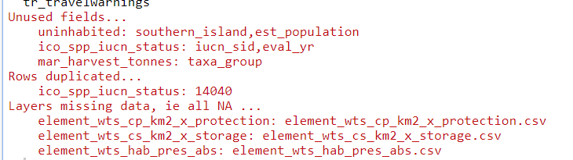

Once the scores are generated, it is important to run the score_check function (step 10).  For the scenario_year argument, be sure to provide the year of the most recent completed assessment:

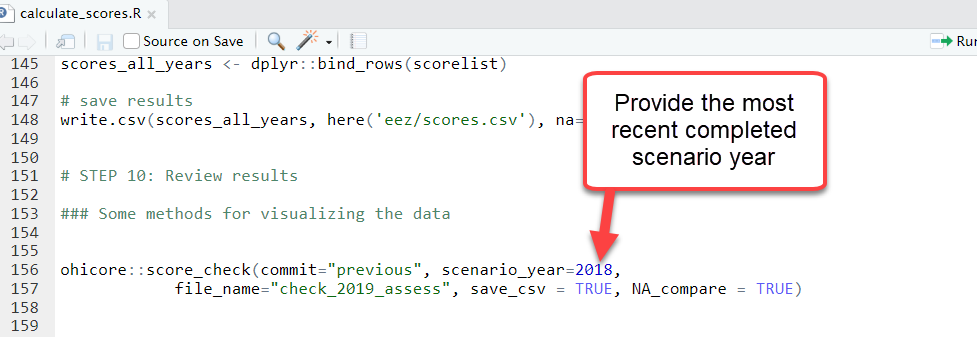

Once, this is run, check the html file that is created.  This file will be in the eez/score_check folder with the name provided in the function (in the above example file_name = "check_2019_assess") with the date it was generated. Ideally, this will be a very boring plot comprised of a series of yellow bars, indicating that nothing changed.  Sadly, you may actually see something like this:

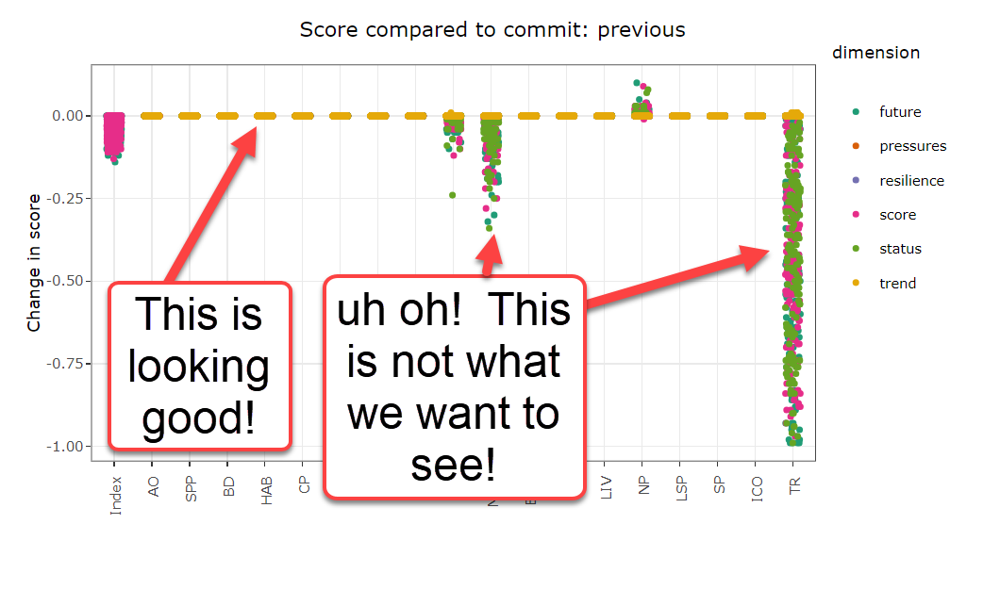

At first glance, the changes to mariculture (and the corresponding food provision goal) and natural products and tourism is worrisome.  If there have been no changes to models or data, these should be the same.  However, I am somewhat reassured that all the changes are fairly small (<1 point change in score).  Regardless, these changes must be explained to convince ourselves that nothing is wrong.

In the Git window, I notice that there were some changes to some reference point files.  Further exploration reveals that adding an additional year changed the reference points of the mariculture and tourism and recreation goals.  This change is fine because the reference points are calculated using all years of data.  The small natural product goal changed for the similar reasons.

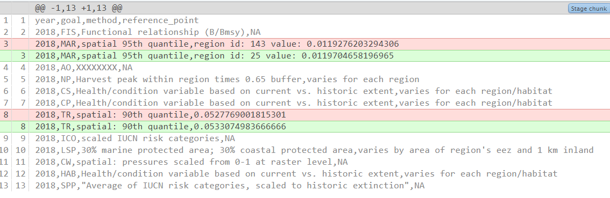

I have now convinced myself that all is well.

The final step of this process is to delete the eez/data_check folder.  This will be created again at the start of the new assessment!  Even though this folder is deleted, the files are preserved in the Git history.  We don't really want this, because these files will not be useful in the future and they are fairly large.  This makes the ohi-global more bulky than it needs to be.  Eventually, we will want to figure out how to delete these large files from Git history.  But I wouldn't bother until it becomes a problem (i.e., when the ohi-global repository starts taking a crazy long time to clone locally).

## Keeping track of layer progress

We use a Google Sheet to help us keep track of where we are in the process of preparing data for the OHI global.  The following is part of the 2019 global assessemnt layers checklist:

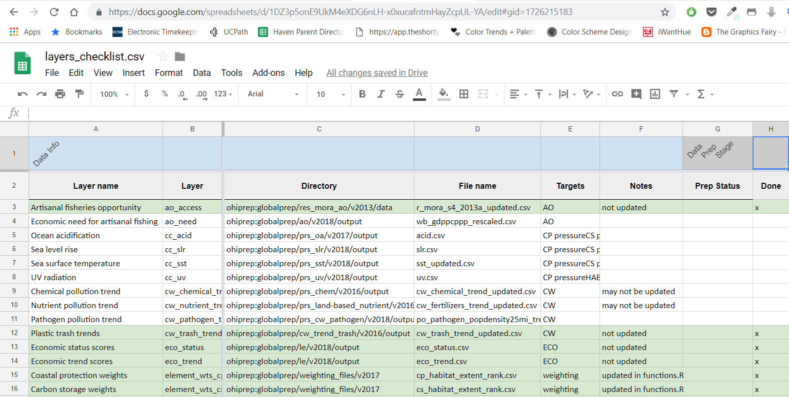

The main part of the checklist is created using code in ohi-global/eez_layers_meta_data/new_year_prep.R.

However, the "Notes" are added in secondarily.  The "Notes" can be used for many things during this process of conducting an assessment, but starting notes include information that is helpful while preparing the data. 

These notes are likely to change every year, but here is a place to start:

Notes     | layers
--------- | ---------------------------------------------------
not updated, no new data  |  ao_access, cw_trash_trend, eco_status, eco_trend, liv_status, liv_trend, fp_habitat, fp_mora, fp_mora_artisanal, g_mariculture, g_msi_gov, g_tourism, hab_coral_health, hab_coral_trend,  hab_mangrove_health, hab_mangrove_trend, hab_saltmarsh_health, hab_saltmarsh_trend, hab_seagrass_health, hab_seagrass_trend, hd_habitat, had_subtidal_hb, le_sector_weight, li_sector_evenness, np_blast, np_cyanide, po_trash, po_water, sp_alien, sp_alien_species 
not updated, considered static data | hab_coral_extent, hab_mangrove_extent, hab_rockyreef_extent, hab_saltmarsh_extent, hab_seagrass_extent, hab_softbottom_extent, rgn_area, rgn_area_inland1km, rgn_area_offshore3nm, rgn_global, rgn_labesl, sp_alien, sp_alien_species, uninhabited
not updated, updated in functions.R | element_wts_cp_km2_x_protection, element_wts_cs_km2_x_storage, element_wts_hab_pres_abs
generated with LSP data | fp_mpa_coast, fp_mpa_eez, hd_mpa_coast, hd_mpa_eez
generated with SPP data | species_diversity_3nm, species_diversity_eez
WGI data    | ss_wgi, wgi_all (pressure and resilience, inverse of one another)
SPI data    | ss_spi, res_spi (pressure and resilience, inverse of one another)
before doing this layer, run code in mar_prs_population | cw_pathogen_trend
layer generated by mariculture script | sp_genetic

This is also a good time to do a literature search (and review issues during the past year) to determine whether there are new data sources for the layers that aren't updated because new source data is unavailable. 