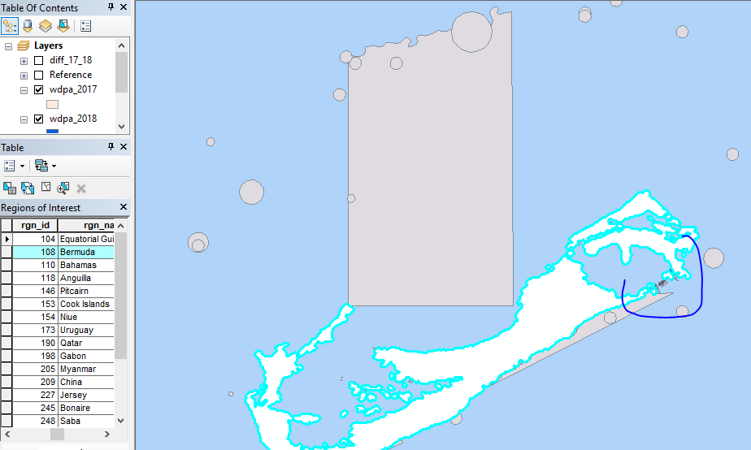

```{r setup, warning=FALSE, message=FALSE, echo=FALSE}

knitr::opts_chunk$set(eval=FALSE)

library(raster)
library(readr)
library(tidyverse)

dir_goal <- "~/github/ohiprep_v2018/globalprep/lsp/v2018"
```

# Summary

* Check outliers in output files from Lasting Special Places data prep
* Prepare raw shapefiles to check in ArcGIS

Check outliers in Status plot


rgn ID    |   rgn name  | status diff  
--------- | -------------- |------- 
  153      | Cook Islands     |  0 -> 100  
  190     | Qatar             |  0 -> 71    
  249     | Sint Eustatius    |  0 -> 54    
  146     | Pitcairn          |  0 -> 50    
  154     | Niue              |  0 -> 36    
  173     | Uruaguay          | 30 -> 97   
  227     | Jersey            | 30 -> 70       
  
# Check Output Files

Regions with differences after adding non-resilience LSP layers

**If no difference, may need to check whether there are additional protected areas within the EEZ not in the coastal or offshore regions.**
``` {r outlier_checks, messages=F, warnings=F}

mpa2018 <- read_csv(file.path(dir_goal, 'output/lsp_prot_area_offshore3nm.csv'))
tpa2018 <- read_csv(file.path(dir_goal, 'output/lsp_prot_area_inland1km.csv'))

marea2018 <- read_csv(file.path(dir_goal, 'output/rgn_area_offshore3nm.csv'))
tarea2018 <- read_csv(file.path(dir_goal, 'output/rgn_area_inland1km.csv'))

mpa2017 <- read_csv(file.path(dir_goal, '../v2017/output/lsp_prot_area_offshore3nm.csv')) #%>%
#  group_by(rgn_id) %>%
#  mutate(a_prot_3nm = cumsum(a_prot_3nm)) 
tpa2017 <- read_csv(file.path(dir_goal, '../v2017/output/lsp_prot_area_inland1km.csv')) # %>%
#  group_by(rgn_id) %>%
#  mutate(a_prot_1km = cumsum(a_prot_1km)) 
marea2017 <- read_csv(file.path(dir_goal, '../v2017/output/rgn_area_offshore3nm.csv'))
tarea2017 <- read_csv(file.path(dir_goal, '../v2017/output/rgn_area_inland1km.csv'))

#lsp_v2017 <- read_csv('~/github/ohi-global/eez2013/scores.csv') 

## Check a few regions from non-resilience LSP layers
#check_rgn <- c(153,190,249,146,154,173,227)
#check_rgn <- c(80,110,205,104,66,42,209)
check_rgn <- c(91,228,92,93,50,179,100,206)

checks <- mpa2018 %>% filter(rgn_id %in% check_rgn) %>% filter(year > 2000) %>% rename(prot_3nm_2018 = a_prot_3nm) %>%
  left_join(tpa2018 %>% filter(rgn_id %in% check_rgn) %>% filter(year > 2000) %>% rename(prot_1km_2018 = a_prot_1km),
            by = c('rgn_id', 'year')) %>%
  left_join(mpa2017 %>% filter(rgn_id %in% check_rgn) %>% filter(year > 2000) %>% rename(prot_3nm_2017 = a_prot_3nm),
            by = c('rgn_id', 'year')) %>%
  left_join(tpa2017 %>% filter(rgn_id %in% check_rgn) %>% filter(year > 2000) %>% rename(prot_1km_2017 = a_prot_1km),
            by = c('rgn_id', 'year')) %>%
  left_join(marea2018 %>% filter(rgn_id %in% check_rgn) %>% rename(marea18 = area),
            by = c('rgn_id')) %>%
  left_join(tarea2018 %>% filter(rgn_id %in% check_rgn) %>% rename(tarea18 = area),
            by = c('rgn_id')) %>%
  left_join(marea2017 %>% filter(rgn_id %in% check_rgn) %>% rename(marea17 = area),
            by = c('rgn_id')) %>%
  left_join(tarea2017 %>% filter(rgn_id %in% check_rgn) %>% rename(tarea17 = area),
            by = c('rgn_id'))

DT::datatable(checks)
```

# Check Intermediate Files

Regions with differences after adding resilience LSP layers. These intermediate files contain both **total area** and **total protected area** within the offshore 3-nm, coastal 1-km, and EEZ region (after processing with zonal stats files and `calc_areas()`).

**If no difference, may need to check whether there are additional protected areas within the EEZ not in the coastal or offshore regions.**

Combine assessment year 2017 and 2018 data
```{r}

## Regions to check: Crozet Islands, Guernsey, Amsterdam Island and Saint Paul Island, Kerguelen Island, France, Malaysia, Republique du Congo, Saudi Arabia
check_rgn <- c(91, 228, 92, 93, 50, 179, 100, 206)

## 2018 offshore 3-nm and coastal 1-km data
off_2018 <- read_csv(file.path(dir_goal, 'int/area_protected_3nm.csv')) %>% 
  filter(year < 2018)
coastal_2018 <- read_csv(file.path(dir_goal, 'int/area_protected_1km.csv')) %>% 
  filter(year < 2018)

## 2017 offshore 3-nm and coastal 1-km data
off_2017 <- read_csv(file.path(dir_goal, '../v2017/int/area_protected_3nm.csv'))
coastal_2017 <- read_csv(file.path(dir_goal, '../v2017/int/area_protected_1km.csv')) 

## Join the above 4 datasets, rename columns to reflect type and assessment year, then summarize the change in values (or area of MPA)
checks <- off_2018 %>% filter(rgn_id %in% check_rgn) %>% rename(prot_3nm_2018 = a_prot_km2, tot_3nm_2018 = a_tot_km2) %>%
  left_join(coastal_2018 %>% filter(rgn_id %in% check_rgn) %>% rename(prot_1km_2018 = a_prot_km2, tot_1km_2018 = a_tot_km2), by = c('rgn_id', 'rgn_name', 'year')) %>%
  left_join(off_2017 %>% filter(rgn_id %in% check_rgn) %>% rename(prot_3nm_2017 = a_prot_km2, tot_3nm_2017 = a_tot_km2), by = c('rgn_id', 'rgn_name', 'year')) %>%
  left_join(coastal_2017 %>% filter(rgn_id %in% check_rgn) %>% rename(prot_1km_2017 = a_prot_km2, tot_1km_2017 = a_tot_km2), by = c('rgn_id', 'rgn_name', 'year')) %>% 
  select(rgn_id, rgn_name, year, tot_3nm_2018, prot_3nm_2018, tot_3nm_2017, prot_3nm_2017, tot_1km_2018, prot_1km_2018,tot_1km_2017, prot_1km_2017)

```


***

# Prepare and Check Raw Files (Optional)

You'll need ArcGIS for this part.

```{r}
library(sp)
library(rgdal)
library(sf)

source('~/github/ohiprep_v2018/src/R/common.R')
```

## Global Regions Shapefile

Select for just the EEZ of each region of interest. Note: shapefile is in Mollweide. Need to transform to match `wdpa_18` and `wdpa_17`

```{r}
regions <- sf::st_read(dsn = file.path(dir_M, "git-annex/globalprep/spatial/v2017"), layer = "regions_2017_update")

## Checked regions for non-resilience LSP layers (status changes)
#check_rgns <- c("Equatorial Guinea", "Bermuda", "Bahamas", "Anguilla", "Pitcairn", "Cook Islands", "Niue", "Uruguay", "Qatar", "Gabon", "Myanmar", "China", "Jersey", "Bonaire", "Saba", "Sint Eustatius", "Aruba", "Madagascar", "Senegal", "Greece")
## Checked additional regions for resilience LSP layers (resilience changes)
check_rgns <- c("Crozet Islands", "Guernsey", "Amsterdam Island and Saint Paul Island", "Kerguelen Islands", "Malaysia", "Republique du Congo", "France", "Saudi Arabia")

regions_int <- regions %>% 
  dplyr::filter(type_w_ant == "eez", rgn_name %in% check_rgns) %>% 
  dplyr::select(rgn_type, rgn_id, rgn_name, geometry)

```

## 2018 June WDPA Shapefile

Transform coordinate system for `regions_int` so they match. Find intersect of WDPA June 2018 data and the EEZs for regions of interest.

```{r}
wdpa_18 <- sf::st_read(dsn = file.path(dir_M, 'git-annex/globalprep/_raw_data/wdpa_mpa/d2018/WDPA_June2018-shapefile'), layer = 'WDPA_June2018-shapefile-polygons')

regions_t <- st_transform(regions_int, st_crs(wdpa_18))
 
check_18 <- st_intersection(wdpa_18, regions_t)
```

## 2017 May WDPA Shapefile

Find intersect of WDPA May 2017 data and the EEZs for regions of interest. 

```{r}
wdpa_17 <- sf::st_read(dsn = file.path(dir_M, 'git-annex/globalprep/_raw_data/wdpa_mpa/d2017/WDPA_May2017-shapefile'), layer = 'WDPA_May2017-shapefile-polygons')
```

* A warning message appeared when reading in `wdpa_17`. This will cause an error when trying to find intersection of the polygons with `st_intersection`. Let's figure out why with `st_is_valid`.

> Warning message: In CPL_read_ogr(dsn, layer, as.character(options), quiet, type, : GDAL Message 1: organizePolygons() received an unexpected geometry. Either a polygon with interior rings, or a polygon with less than 4 points, or a non-Polygon geometry. Return arguments as a collection.

* Set up parallel computing (limit number of mazu cores as other people need to use them!) to check each row in `wdpa_17` for invalid geometries. Set `reason=T` to print reasons (e.g. self-intersecting).
* Remove invalid geometries and save so you don't have to run the parallel computing again.
```{r}
library(doParallel)
registerDoParallel(cores = 4) # set the number of cores so you don't use up all of mazu's cores
#getDoParWorkers()

## Check each row to see if reason=T will print reasons (e.g. Self-intersecting) for invalid geometries.

inval_geo <- foreach(i = 1:nrow(wdpa_17), .combine=rbind) %dopar%
  st_is_valid(wdpa_17[i,],reason=T)

write.csv(inval_geo, file.path(dir_M,"git-annex/globalprep/_raw_data/wdpa_mpa/d2017/WDPA_May2017-shapefile/check_invalid_geometry.csv"), row.names = F) # save to review later

## Append invalid geometry dataframe to 2017 WDPA data frame and filter for only valid geometries
## About 2000+ invalid entries mostly 'Ring Self-intersection'
wdpa_valid_17 <- cbind(wdpa_17, inval_geo) %>% 
  filter(inval_geo == "Valid Geometry")

## Save for future checks
## Got a lot of warnings: 1: In CPL_write_ogr(obj, dsn, layer, driver, as.character(dataset_options),  ... : GDAL Message 1: Value 555543796 of field WDPAID of feature 8 not successfully written. Possibly due to too larger number with respect to field width
st_write(wdpa_valid_17, file.path(dir_M,"git-annex/globalprep/_raw_data/wdpa_mpa/d2017/WDPA_May2017-shapefile/WDPA_May2017-shapefile-polygons-corrected.shp")) 

```

Find intersect of fixed WDPA May 2017 data and the EEZs for regions of interest.
```{r}

wdpa_valid_17 <- sf::st_read(dsn = file.path(dir_M, 'git-annex/globalprep/_raw_data/wdpa_mpa/d2017/WDPA_May2017-shapefile'), layer = 'WDPA_May2017-shapefile-polygons-corrected')

check_17 <- st_intersection(wdpa_valid_17, regions_t)
```

## Save Subsetted 2017 and 2018 Data

Warnings: In CPL_write_ogr(obj, dsn, layer, driver, as.character(dataset_options),  ... : GDAL Message 1: Value 555548860 of field WDPAID of feature 262 not successfully written. Possibly due to too larger number with respect to field width

```{r}
st_write(check_17, file.path(dir_M,"git-annex/globalprep/_raw_data/wdpa_mpa/d2018/check/WDPA_May2017-shapefile-polygons-check.shp"), driver = "ESRI Shapefile", delete_layer = TRUE)

st_write(check_18, file.path(dir_M,"git-annex/globalprep/_raw_data/wdpa_mpa/d2018/check/WDPA_June2018-shapefile-polygons-check.shp"), driver = "ESRI Shapefile", delete_layer = TRUE)

st_write(regions_t, file.path(dir_M,"git-annex/globalprep/_raw_data/wdpa_mpa/d2018/check/check_ohi_regions.shp"), driver = "ESRI Shapefile", delete_layer = TRUE)
```


## View in ArcGIS

Open up 2017 (`check_17`), 2018 (`check_18`), and EEZ-regions (`regions_t`) shapefiles in ArcGIS to see the data! 

Tip: open the attributes table of the EEZ-regions, highlight the row of the region you want to investigate (e.g. Bermuda) and select *zoom to selected* to view the 2017 and 2018 protected area differences for a region of interest. Click on `rgn_name` column to sort alphabetically - makes searching for regions easier.



*** 

Clean up working space
```{r}
rm(wdpa_17,wdpa_18,wdpa_valid_17, check_17, check_18)
```

